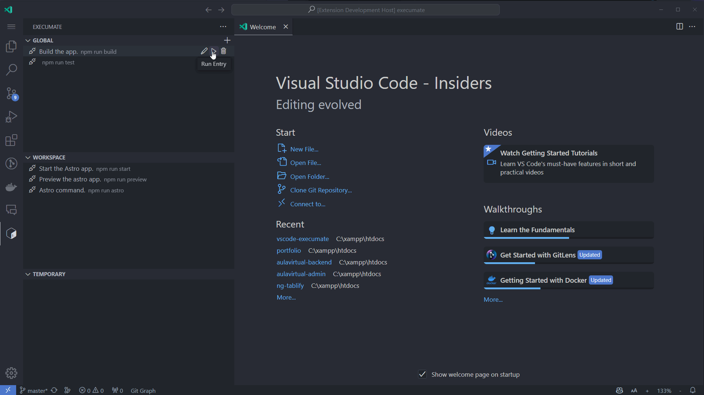

  
  <h1>ExecuMate</h1>
  

    <b>ExecuMate</b> is a Visual Studio Code extension that allows you to create and manage terminals with specific commands.
  

## Features

---

With this extension you will forget about working with VS Code Tasks. This easily allows you to create new terminals and execumate specific commands with just one click. You can delete the terminals you don't use anymore or you can edit them to better suit your necessities.

Global commands are maintained between projects, while workspace commands are shared amongst each individual working on the project (and each one can create new ones). Temporary commands are short-lived terminals for sending commands and are automatically deleted upon exit.

> [!IMPORTANT]  
> Activating this extension will dispose any terminal running, stopped or idling. So keep that in mind!

## Release Notes

---

### 1.0.0

- Initial release of ExecuMate!

## Known Issues

---

- None so far

## What's coming next?

---

- [ ] Add a feature to show/hide commands.
- [ ] Add a feature to show/hide a list of commands under a section (hide all global commands, etc).
- [ ] Add a feature for you to be able to select the icon which shows up in the contributed view.
- [ ] Add a feature to create commands with different shells (cmd, bash, powershell, etc).

## Contributing

---

If you want to contribute to this project, please feel free to submit a pull request or create an issue. I am always looking to improve the user experience and add new features.

## License

---

